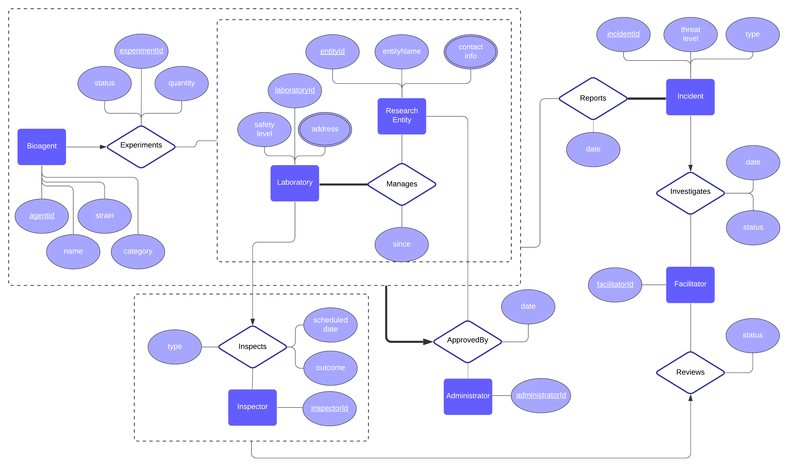

COMS W4111 - Introduction to Databases - Project #1
==========================================================

#### Project 1 for the Fall of 2021
#### Authors : [Cristopher Benge](https://cbenge509.github.io/) | [Chisom Amalunweze](https://www.linkedin.com/in/chisomamalunweze/)
    
Columbia University in the City of New York

Masters of Science in Computer Science - Machine Learning Concentration  
Section V03 - [Alexandros Biliris, PhD](http://www.cs.columbia.edu/~biliris/)

---

## Description

This repository contains the collaboration between Cris and Chisom for the Project 1, Part 3 assignment from the Fall 2021 course of *Introduction to Databases* (COMS W4111, section V03 (CVN)).  Part 3 of the project is focused on designing a [very] basic UI in Python 3.x to interact with the tables, execute a variety of SQL queries, etc.  All of the requirements are outlined fully in [the online rubric for this assignment](https://www.cs.columbia.edu/~biliris/4111/21f/projects/proj1-3/proj1-3.html).

--- 

## Important Files

| File | Description |
|:-----|:------------|
| [create_tables.sql](./sql_scripts/create_tables.sql) | SQL script used to create the tables in a PostgreSQL database for Project 1, Part 2 (approved by TA) |
| [populate_date.sql](./sql_scripts/populate_data.sql) | SQL script used to populate simulated data for the tables in a PostgreSQL database for Project 1, Part 2 (approved by TA) |

---

## ER Diagram

A depiction of our database diagram is available below for reference:

## Other Information 

A few important links for the course has been provided below:

 - [Official Syllabus](https://www.cs.columbia.edu/~biliris/4111/21f/)
 - [Ed Discussion Forum](https://edstem.org/us/courses/13950/discussion/) *(replaces Piazza)*
 - [Gradescope](https://www.gradescope.com/courses/313462) for submitting assignments.

---

## License
-------
Licensed under the MIT License. See [LICENSE](LICENSE) file for more details.
